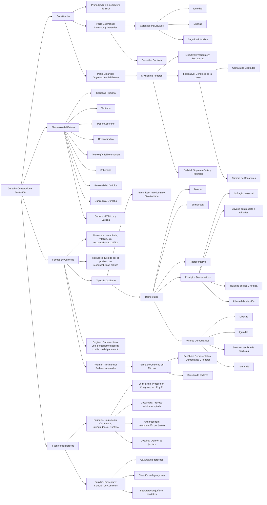

# Derecho

**Conclusión:**

La relación entre los elementos del Estado y la forma de gobierno es esencial para comprender cómo una nación organiza su estructura jurídica, política y social. El Estado requiere de elementos básicos como el territorio, la población y el poder soberano, los cuales se articulan mediante un orden jurídico que da legitimidad a su funcionamiento. La forma de gobierno, por su parte, define cómo se distribuye ese poder y cómo se relacionan los órganos del Estado entre sí y con los ciudadanos. En México, la forma republicana, democrática y federal asegura que el poder emane del pueblo y esté distribuido entre los poderes Ejecutivo, Legislativo y Judicial, garantizando la protección de los derechos humanos, la justicia, el bienestar social y la participación ciudadana. Esta articulación fortalece la gobernabilidad y promueve una sociedad más equitativa y respetuosa de la ley.
